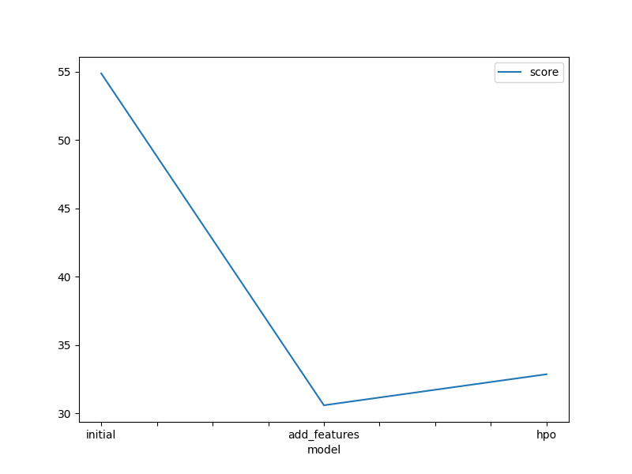
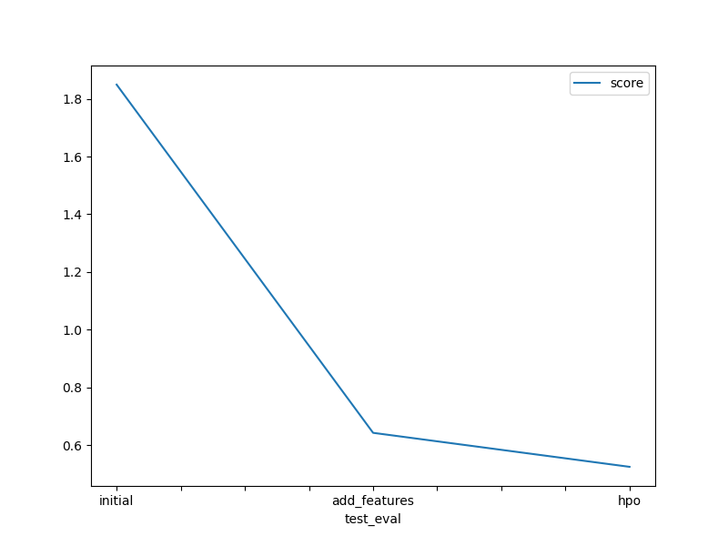

# Report: Predict Bike Sharing Demand with AutoGluon Solution
#### Pavana P Karanth

## Initial Training
### What did you realize when you tried to submit your predictions? What changes were needed to the output of the predictor to submit your results?
AutoGluon's predictions output a Pandas Series that needed to be inserted into the sample submission format. The submission required column formatting (['datetime', 'count']) and ensuring that predictions matched the test set index.

Also, it has to have only positive values while submitting to kaggle. 

### What was the top ranked model that performed?
Case A (Default AutoGluon): WeightedEnsemble_L3
Score (RMSE): 54.86

Case B (with addiitional hour feature): WeightedEnsemble_L3
Score (RMSE): 30.59

Case C (with 'very_light' hyperparameters and tuning enabled): WeightedEnsemble_L3
Score (RMSE): 32.86 

## Exploratory data analysis and feature creation
### What did the exploratory analysis find and how did you add additional features?
Some observations I have made during EDA: 
* Working days have much higher usage than holidays.
* registered users are higher than casual users.
* wind speed and humidity are skewed, most days have moderate to high humidity and low winds.

The additional feature added is hour extraction from datetime. 

### How much better did your model preform after adding additional features and why do you think that is?
Before hour feature: RMSE = 54.87 (WeightedEnsemble_L3)
After hour feature: RMSE = 30.59 (WeightedEnsemble_L3)
This is almost 40% increase and it's pretty significant. 
Also, The morning/evening peaks is the primary driver of bike sharing demand. Without the hour feature, models couldn't learn this critical temporal pattern.
Upon this, we can also see LightGBM, CatBoost, and RandomForest perfoming better significantly as they got benifited with hour feature (Tree based models, the nonlinear relationship is captured!)

## Hyper parameter tuning
### How much better did your model preform after trying different hyper parameters?
The model showed moderate improvement after hyperparameter optimization:
Kaggle score improvement: 0.64250 → 0.52465 reduction in RMSE)
Validation score: Slight regression from 30.59 → 32.86 (possible overfitting)

The HPO provided meaningful but not dramatic improvement compared to the massive gains from feature engineering (1.80 → 0.64). This suggests that:
* Feature engineering was the primary driver of performance gains
* Default AutoGluon parameters were already quite good for this dataset

### If you were given more time with this dataset, where do you think you would spend more time?
I would spend more time doing the feature engineering for this project + on hyperparameter optimizations!!
I would look at weather and date time extractions in the data.

### Create a table with the models you ran, the hyperparameters modified, and the kaggle score.
|model|hpo1|hpo2|hpo3|score|
|--|--|--|--|--|
|initial|54.87|54.91|60.75|1.79937|
|add_features|30.59|30.83|31.52|0.64250|
|hpo|32.86|33.71|34.75|0.52465|

### Create a line plot showing the top model score for the three (or more) training runs during the project.

### Create a line plot showing the top kaggle score for the three (or more) prediction submissions during the project.

## Summary
## Project Summary
This bike sharing demand prediction project demonstrated the critical importance of feature engineering over hyperparameter optimization. Starting with a baseline RMSE of 1.80 on Kaggle, the addition of an hour feature extracted from datetime data provided dramatic improvement, reducing the error to 0.64 by capturing essential commuting patterns with bimodal peaks at 8 AM and 5-6 PM. Next hyperparameter optimization using AutoGluon's ensemble methods provided additional gains, achieving a final Kaggle score of 0.52. The WeightedEnsemble_L3 model consistently outperformed individual algorithms by leveraging multiple stacking levels and diverse prediction sources. The results highlight that understanding domain-specific temporal patterns in bike sharing systems more impactful than fine-tuning model parameters, with feature engineering contributing more improvement than HPO. More work can be done on HPO. 
